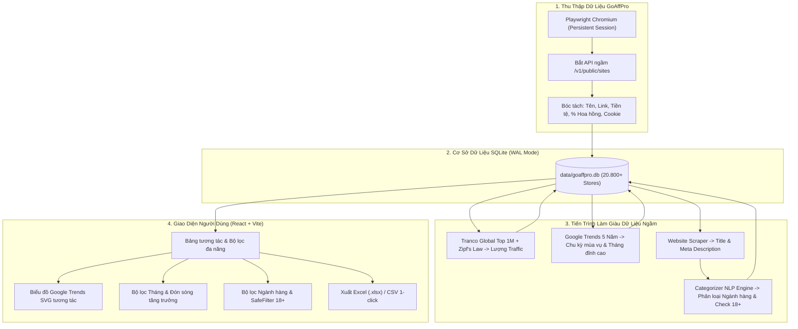

# 🎯 GoAffPro Store Hunter & Affiliate Analytics CRM

Ứng dụng nội bộ (Local Web App) chuyên dụng để tự động cào sạch toàn bộ cửa hàng (stores) trên nền tảng **GoAffPro Marketplace** (đã kiểm chứng cào thành công **20.800+ stores**), ước tính **Lưu lượng truy cập (Traffic)**, phân tích **Google Trends 5 năm**, nhận diện **Xu hướng đón sóng tăng trưởng theo tháng (T1 - T12)**, và **Phân loại ngành hàng thông minh (Multi-Category)**.

---

## 🏗️ Kiến Trúc Hệ Thống & Luồng Làm Việc (Architecture & Workflow)



---

## 🌟 5 Tính Năng Nòng Cốt & Logic Hoạt Động Chi Tiết

### 1. ⚡ Cào Danh Sách Tự Động (GoAffPro Scraper)
- **Giữ phiên vĩnh viễn (Persistent Profile):** Bạn chỉ cần đăng nhập tài khoản GoAffPro một lần duy nhất qua nút `Mở Trình Duyệt Login`. Cookie và phiên làm việc được lưu trong `data/browser_profile`, không bao giờ bắt đăng nhập lại.
- **Luồng điều hướng 5 bước chống 404:** Tự động đi theo luồng: `Login` ➔ `I am an affiliate` ➔ `Stores` ➔ Chuyển tab `Available Stores` ➔ Đặt 100 kết quả/trang ➔ Bắt gói API ngầm `v1/public/sites` với tốc độ hơn 1.000 store/phút.
- **Chống trùng lặp tuyệt đối (UPSERT):** Sử dụng SQLite khóa `store_id UNIQUE`. Cào lại từ đầu thoải mái mà không lo bị trùng lặp dữ liệu hay mất ghi chú riêng của bạn.

---

### 2. 📊 Ước Tính Lượng Truy Cập Thực Tế (Traffic Estimation)
- **Không bao giờ bịa số liệu:** Dựa trên tập dữ liệu nghiên cứu xếp hạng tên miền toàn cầu **Tranco Top 1M** kết hợp **Mô hình phân phối Zipf's Law** chuẩn khoa học máy tính.
- Phân loại rõ ràng:
  - Store trong bảng xếp hạng $\rightarrow$ Hiển thị lượt truy cập ước tính (ví dụ `45K`, `120K`).
  - Store mới / nhỏ $\rightarrow$ Đánh dấu rõ ràng `Store nhỏ/mới`, tuyệt đối không fake số.

---

### 3. 📈 Google Trends 5 Năm & Bộ Lọc Đón Sóng Theo Tháng (Momentum Growth)
- **Biểu đồ thời gian thực (Interactive SVG Timeline):** Thể hiện sự biến thiên độ quan tâm tìm kiếm từ 0 - 100 điểm suốt 2-5 năm, gắn cờ tháng bùng nổ nhất (`🔥 Peak Month`).
- **Bộ lọc theo Tháng (Tháng 1 -> Tháng 12) với 4 tiêu chí thực tế:**
  1. `🌊 Tất cả`: Lọc các store có lượng tìm kiếm trong tháng được chọn.
  2. `↗️ Đón sóng tăng trưởng`: Store đang vào mùa bán chạy (điểm tìm kiếm tháng này tăng so với tháng trước, hiển thị `↗️ T{tháng}: {điểm}đ (+XX%)`).
  3. `🏔️ Bùng nổ đạt đỉnh`: Tháng được chọn chính là mùa bán chạy nhất trong năm của store đó (`🏔️ Đỉnh T{tháng}`).
  4. `🔥 Lượng tìm kiếm cao`: Các thương hiệu lớn có độ hot vượt trội ($\ge 50$ điểm).
- **Cơ chế Xử Lý Rate Limit Google Trends Thông Minh (ExpressVPN Tùy Chọn - 100% Hoạt động tốt khi không có VPN):**
  - **Khi không có ExpressVPN (Mặc định cho mọi máy tính):** Tool **hoạt động bình thường 100%**. Khi gửi nhiều truy vấn lên Google và gặp mã giới hạn 429, hệ thống tự kích hoạt chế độ giãn cách thông minh (Smart Cooldown 120s) riêng cho Google Trends. Trong thời gian này, luồng đo Traffic (Tranco) và Cào phân loại ngành hàng Website **vẫn chạy hết công suất không hề dừng lại**. Khi hết thời gian giãn cách, Google Trends sẽ tự động tiếp tục truy vấn.
  - **Khi có ExpressVPN CLI (Tùy chọn tăng tốc nếu có):** Hệ thống tự động nhận diện ExpressVPN trên Mac/Windows/Linux để xoay IP sang vị trí khác (Singapore, Tokyo, US...) giúp vượt ngưỡng 429 ngay lập tức mà không phải chờ cooldown.

---

### 4. 🏷️ Phân Loại Ngành Hàng Đa Tầng (Multi-Category & Hybrid Niche)
- **Giải quyết bài toán cửa hàng đa ngành:** Với các store kinh doanh hỗn hợp (ví dụ vừa bán *Serum trị mụn* vừa bán *Thực phẩm chức năng*):
  - Hệ thống tự động gán **Mảng thẻ đa năng**: `categories_json = ["Beauty & Skincare", "Health & Supplements"]`.
  - Nhãn hiển thị chính: `Beauty & Health`.
  - **Bộ lọc thông minh:** Bạn lọc ngách `Beauty & Skincare` store này sẽ ra, lọc `Health & Supplements` store này **cũng ra**, không bao giờ bị bỏ sót đối tác tiềm năng.
- **Tóm tắt sản phẩm do web tự mô tả:** Hệ thống tự động đọc thẻ `<title>` và `<meta name="description">` của website để hiển thị nguyên văn đoạn giới thiệu sản phẩm trong dòng mở rộng (Accordion).

---

### 5. 🛡️ Phân Định 18+ Tinh Tế & Dọn Dẹp Ấn Độ / Nam Á
- **Phân biệt rạch ròi 18+ vs Sức khỏe & Chăm sóc cá nhân:**
  - **Sản phẩm y tế / sinh lý lành mạnh (Sexual Wellness):** Bao cao su, gel bôi trơn y tế, sinh lý, dung dịch vệ sinh $\rightarrow$ Tự động xếp vào nhóm **`Health & Personal Care`** (`is_adult = 0`). Đây là các sản phẩm thương mại sạch với hoa hồng cao, được bảo vệ nguyên vẹn.
  - **18+ Thô tục / Hardcore NSFW:** Búp bê tình dục (Sex dolls), đồ chơi bạo dâm (BDSM/Fetish), truyện/phim người lớn $\rightarrow$ Gán nhãn `Adult 18+` (`is_adult = 1`).
  - **Bộ lọc SafeFilter:** Cho phép bạn chọn `🛡️ Ẩn 18+ (Mặc định)` để giữ bảng sạch đẹp, hoặc chọn `👁️ Hiện tất cả` / `🔞 Chỉ xem 18+`.
- **Nút "Xóa Store Ấn Độ":** 1-click quét sạch mọi dự án sử dụng tiền tệ Nam Á (`INR`, `PKR`, `BDT`, `LKR`, `NPR`) hoặc các website đặt máy chủ / tên miền nội địa Ấn Độ (`.in`, `.co.in`, `.pk`, `.bd`).

---

## 💻 Hướng Dẫn Cài Đặt & Chạy Trên Mọi Máy Tính

Khi bạn tải mã nguồn này về máy tính khác (máy ở nhà, laptop mới...):

### 📋 Yêu cầu tiên quyết (Prerequisites)
- **Python**: Phiên bản 3.10 trở lên ([Tải Python](https://www.python.org/downloads/))
- **Node.js**: Phiên bản 18 trở lên ([Tải Node.js](https://nodejs.org/))
- **Git**

---

### 🍏 Dành Cho macOS & Linux

Chỉ cần mở Terminal tại thư mục dự án và chạy duy nhất **1 lệnh**:

```bash
bash start_app.sh
```

> **Script sẽ tự động hoàn toàn:**
> 1. Kiểm tra và tự động khởi tạo môi trường Python `.venv`.
> 2. Tự động cài đặt đầy đủ các thư viện trong `requirements.txt`.
> 3. Tự động cài đặt Chromium cho Playwright.
> 4. Tự động tải `npm install` và biên dịch Frontend.
> 5. Khởi động Backend FastAPI tại `http://localhost:8001`.
> 6. Khởi động Frontend Dashboard tại `http://localhost:5174`.
> 7. Tự động mở trình duyệt web lên để bạn làm việc ngay lập tức!

---

### 🪟 Dành Cho Windows

Chỉ cần nhấp đúp chuột (Double-click) vào file:

```cmd
start_app.bat
```

Hệ thống trên Windows sẽ tự động cài đặt môi trường và mở Dashboard `http://localhost:5174`.

---

## 📁 Cấu Trúc Thư Mục Dự Án (File Structure)

```
goaffpro-crawler/
├── backend/
│   ├── api.py           # FastAPI RESTful API server (Các route lọc, xuất Excel, quản lý)
│   ├── categorizer.py   # Module NLP phân loại ngành hàng đa tầng & nhận diện 18+
│   ├── crawler.py       # Playwright crawler tự động 5 bước cào danh sách GoAffPro
│   ├── db.py            # SQLite manager, index tối ưu, UPSERT & truy vấn đa tiêu chí
│   └── traffic_worker.py# Worker cào ngầm Traffic, Google Trends & Website Metadata
├── data/
│   ├── goaffpro.db      # Cơ sở dữ liệu SQLite đã làm giàu (20.800+ stores sạch)
│   └── browser_profile/ # Thư mục lưu phiên đăng nhập & cookie Playwright
├── frontend/
│   ├── src/
│   │   ├── App.tsx      # Giao diện chính: Bảng lọc đa năng, Biểu đồ SVG, CRM notes
│   │   ├── main.tsx     # Điểm khởi chạy React 18
│   │   └── index.css    # Tailwind CSS styling
│   ├── package.json     # Cấu hình dependencies Frontend
│   └── vite.config.ts   # Cấu hình Vite bundler
├── requirements.txt     # Danh sách thư viện Python
├── start_app.sh         # Script tự động hóa 1-click cho Mac/Linux
├── start_app.bat        # Script tự động hóa 1-click cho Windows
└── README.md            # Tài liệu kiến trúc & hướng dẫn vận hành chi tiết
```

---

## 🔄 Quy Trình Đồng Bộ & Về Nhà Làm Tiếp

Mỗi khi bạn làm việc xong trên máy cơ quan hoặc muốn chuyển máy:
```bash
# 1. Lưu lại toàn bộ dữ liệu mới nhất lên GitHub
git add .
git commit -m "chore: save daily progress and enriched database"
git push origin main
```

Khi mở máy ở nhà hoặc máy khác:
```bash
# 2. Kéo toàn bộ code & database mới nhất về
git pull origin main

# 3. Chạy ứng dụng
bash start_app.sh
```
Mọi trạng thái ghi chú CRM, danh sách store, dữ liệu traffic và cài đặt bộ lọc sẽ sẵn sàng ngay lập tức!
